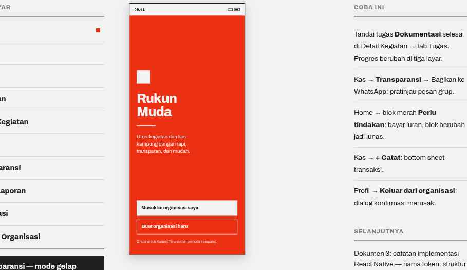

# 01 · Splash

**Route** `RootStack/Splash` · no header, no tabs
**Purpose** State the promise and offer two ways in.

## Layout
Full-bleed `color.accent` background, `color.onAccent` text, padding 32 / 24.

| Order | Element | Spec | Copy |
| --- | --- | --- | --- |
| 1 | Mark | 44×44 square, `color.bg` fill, margin-bottom 28 | — |
| 2 | Wordmark | `type.display` (40/800, ls −1.2), two lines | `Rukun` / `Muda` |
| 3 | Rule | 2px, `color.bg`, width 64, margin 24 vertical | — |
| 4 | Promise | 17px / lineHeight 24.5, max ~22ch | `Urus kegiatan dan kas kampung dengan rapi, transparan, dan mudah.` |
| 5 | Primary button | height 52, fill `color.bg`, label `color.text` 15/800 flush left | `Masuk ke organisasi saya` |
| 6 | Secondary button | height 52, 1px `color.bg` border, label `color.onAccent` | `Buat organisasi baru` |
| 7 | Footnote | 12px, opacity 0.8, margin-top 6 | `Gratis untuk Karang Taruna dan pemuda kampung.` |

Blocks 1–4 sit centered in the remaining space (`flex: 1`, `justifyContent: 'center'`); the buttons pin to the bottom with `gap: 10`.

## Behavior
- Shown at most 1.2s while restoring the session; if already signed in, go straight to Home.
- No logo animation. Both buttons navigate to `Login`.
