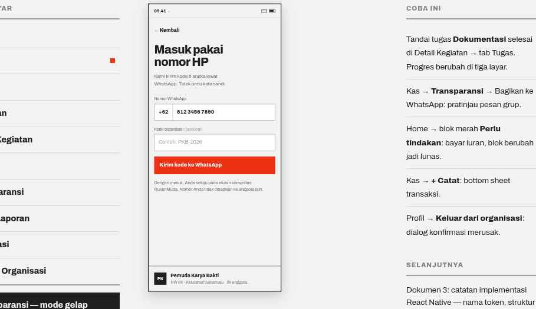

# 02 · Login

**Route** `RootStack/Login` · no tabs
**Purpose** Sign in with a WhatsApp number. No password.

## Layout
`color.bg`, screen padding 16.

| Order | Element | Spec | Copy |
| --- | --- | --- | --- |
| 1 | Back | 15/800, hitSlop 12, padding-top 24 | `← Kembali` |
| 2 | Title | `type.h1` at 34px, max 14ch | `Masuk pakai nomor HP` |
| 3 | Explainer | 14px `color.textMuted`, max 30ch, margin-top 12 | `Kami kirim kode 6 angka lewat WhatsApp. Tidak perlu kata sandi.` |
| 4 | Field: number | label `type.caption`; row of two boxes, 1px `color.divider` on `color.surface`; prefix box `+62` 15/800 with a right border; value 15/800; min height 48 | label `Nomor WhatsApp` |
| 5 | Field: org code | same box, placeholder in `color.textFaint` | label `Kode organisasi (opsional)`, placeholder `Contoh: PKB-2026` |
| 6 | Primary button | block, height 52, `color.accent` | `Kirim kode ke WhatsApp` |
| 7 | Privacy note | 12.5px `color.textMuted` | `Dengan masuk, Anda setuju pada aturan komunitas RukunMuda. Nomor Anda tidak dibagikan ke anggota lain.` |
| 8 | Detected org | pinned to the bottom above a 2px `color.rule`; Avatar 36 + name 14/800 + meta 12px `color.textMuted` | `Pemuda Karya Bakti` · `RW 04 · Kelurahan Sukamaju · 24 anggota` |

Fields use `gap: 16`.

## Behavior
- Numeric keyboard. Validate on blur; error text 12.5px `color.accent700` under the field.
- The OTP step reuses this screen: six 48×56 boxes, 1px `color.divider`, digit 20/800 centered.
- Success replaces the stack with `App/HomeTab/Home`.
