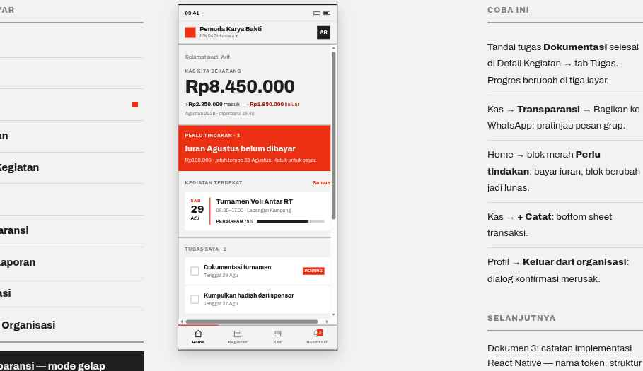

# 03 · Home

**Route** `App/HomeTab/Home`
**Purpose** Answer "what is happening in my organization?" in one scroll.

## Layout — the order is binding
Balance first, then whatever demands action, then the rest.

| Order | Block | Spec |
| --- | --- | --- |
| 1 | **Header** | height 56, 2px bottom `color.rule`. Left: 26×26 `color.accent` mark. Center: org name 15/800 plus `RW 04 Sukamaju ▾` 11px `color.textMuted` (tap opens the org switcher). Right: Avatar 32 → `Profil` modal. |
| 2 | Greeting | 14px `color.textMuted`, e.g. `Selamat pagi, Arif.` |
| 3 | **BalanceDisplay** | SectionHeader `KAS KITA SEKARANG`; amount `type.numHero` in `color.balance`, tappable → Kas; below it a 13px row `+Rp2.350.000 masuk` / `−Rp1.850.000 keluar` (amounts 800, expense in `color.expense`); meta 12px `Agustus 2026 · diperbarui 19.40`. Block closes with a 2px `color.rule`. |
| 4 | **Card inverted — "Perlu tindakan"** | Full-bleed `color.accent`, padding 16. SectionHeader `PERLU TINDAKAN · 3` at opacity 0.9; title 19/800; sub 13px opacity 0.9. Tap opens the dues flow. |
| 5 | Kegiatan terdekat | SectionHeader plus `Semua` action (12/800 `color.accent`) → Kegiatan. One EventItem inside a Card. |
| 6 | Tugas saya | SectionHeader `TUGAS SAYA · 2`; at most 2 TaskItems in one Card. |
| 7 | Pengumuman | SectionHeader; 4px left border `color.text`, padding-left 12; title 15/800, body 13px, byline 11px `color.textMuted`. |
| 8 | Aktivitas terbaru | SectionHeader plus `Lihat kas` action; 2 TransactionItems. |

Blocks 3, 5, 6 and 7 each end with a 2px `color.rule`.

## Behavior
- **The red block renders only when something is pending.** When nothing is pending, remove the block entirely — do not substitute an empty-state message.
- Tapping the balance goes to Kas. Pull to refresh reloads every block.
- Loading: three skeleton blocks (balance, event, activity) — never a full-screen spinner.
- Error: keep cached data on screen, add a band `Data per 24 Agu, 19.40` and a retry button.
