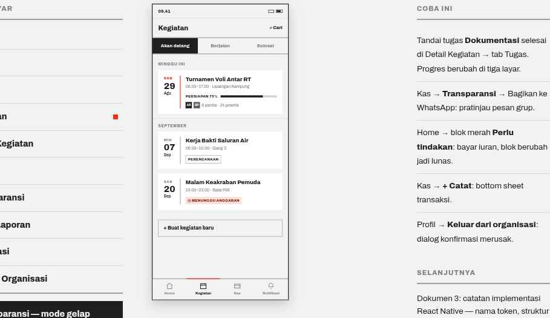

# 04 · Kegiatan

**Route** `App/KegiatanTab/Kegiatan`
**Purpose** See what the organization is working on.

## Layout
| Order | Block | Spec |
| --- | --- | --- |
| 1 | Header | height 56, title `Kegiatan` 19/800, right action `⌕ Cari` 13/800 |
| 2 | Segmented | full width, 3 options, height 44, closed by a 2px `color.rule`: `Akan datang` / `Berjalan` / `Selesai` |
| 3 | Grouped list | SectionHeader per group (`MINGGU INI`, `SEPTEMBER`, `PERENCANAAN`), then EventItem Cards at margin 16 with `gap: 12` |
| 4 | Add | Secondary button, full width: `+ Buat kegiatan baru` |

## EventItem states used here
- **Scheduled and upcoming** — date block right border 2px `color.accent`, day label in `color.accent`, progress bar and people row present.
- **Planned, no date fixed** — date block right border `color.divider`, labels `color.textMuted`, Tag outline `PERENCANAAN`.
- **Blocked** — Tag tint `◷ MENUNGGU ANGGARAN` (`color.accent200` fill, `color.accent800` text).

## Behavior
- Group by time, never alphabetically.
- Each segment carries its own EmptyState, e.g. `Belum ada kegiatan bulan ini` / `Kegiatan yang dibuat pengurus akan muncul di sini.` with a `Buat kegiatan` button.
- Tapping a card opens EventDetail inside this stack.
