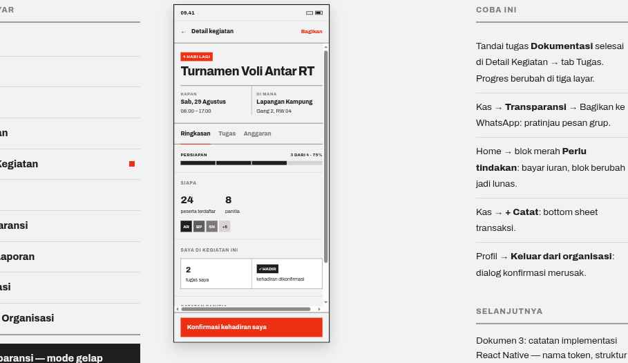

# 05 · Event Detail

**Route** `HomeStack/EventDetail` and `KegiatanStack/EventDetail`
**Purpose** Run one activity: what, when, where, who — then tasks and budget.

## Layout
| Order | Block | Spec |
| --- | --- | --- |
| 1 | Header | `←` · `Detail kegiatan` 14/800 · `Bagikan` 13/800 `color.accent` |
| 2 | Hero | Tag accent `4 HARI LAGI`; title 30/800 ls −0.75; then a two-column block under a 2px `color.rule` — `KAPAN` (`Sab, 29 Agustus` 14/800 and `08.00 – 17.00` 13px) and `DI MANA` (`Lapangan Kampung` and `Gang 2, RW 04`), split by a 1px vertical `color.divider` |
| 3 | Tabs | left-aligned, gap 20, padding 14 vertical, container closed by 2px `color.rule`, active marked with 2px `color.accent`: `Ringkasan` / `Tugas` / `Anggaran` |
| 4 | Tab content | see below |
| 5 | Action bar | 2px top `color.rule`, padding 12/16, primary block button `Konfirmasi kehadiran saya` |

### Tab: Ringkasan
Segmented Progress (`PERSIAPAN` · `3 DARI 4 · 80%`, four segments, gap 2) · counts block (`24` peserta / `8` panitia at 26/800) · Avatar group at 28 ending in `+5` · a "Saya di kegiatan ini" two-cell bordered block (task count 20/800, Tag solid `✓ HADIR`) · `CATATAN PANITIA` paragraph at 13.5px.

### Tab: Tugas
SectionHeader `4 TUGAS PERSIAPAN`, then TaskItems in one Card. Done: 20×20 box filled `color.text` with `✓`, title struck through at opacity 0.5, meta `Agus · selesai 20 Agu`. Open: 1.5px `color.divider` box, Tag accent `PENTING` where flagged. Footnote 12.5px: `Ketuk tugas untuk menandai selesai. Perubahan langsung terlihat oleh ketua panitia.`

### Tab: Anggaran
Budget total 34/800 tabular · meta `Terpakai Rp1.850.000 · sisa Rp1.350.000` · bar Progress height 10 · TransactionItem list scoped to this event · secondary button `+ Catat pengeluaran kegiatan` (treasurer and chair only).

## Behavior
- Toggling a task raises a Toast (`Tugas "Dokumentasi" selesai.`) with `Haptics.selectionAsync()` and **updates prep progress on Home and Kegiatan** — one shared source of truth.
- The task checkbox renders at 20 but its touch target is 48 via hitSlop.
- `+ Catat pengeluaran` opens the transaction BottomSheet.
