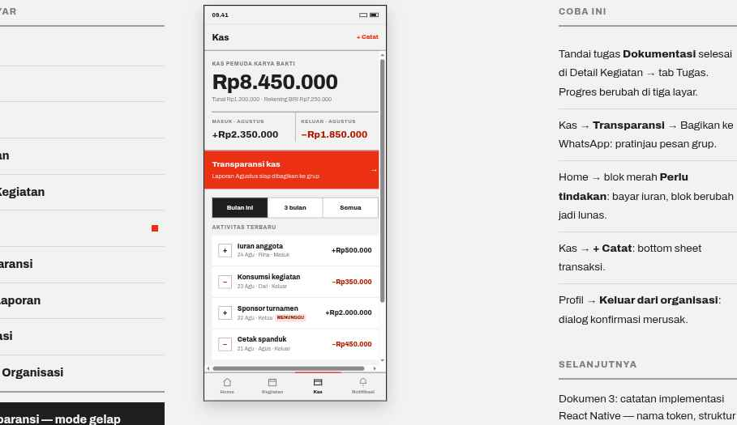

# 06 · Kas

**Route** `App/KasTab/Kas`
**Purpose** Answer "how much do we have, and where did it go?" without feeling like accounting software.

## Layout
| Order | Block | Spec |
| --- | --- | --- |
| 1 | Header | title `Kas` 19/800, right action `+ Catat` 13/800 `color.accent` |
| 2 | BalanceDisplay | SectionHeader `KAS PEMUDA KARYA BAKTI`; `type.numHero`; wallet split meta 12px `Tunai Rp1.200.000 · Rekening BRI Rp7.250.000`; a two-cell month summary under a 2px `color.rule` (`MASUK · AGUSTUS` / `KELUAR · AGUSTUS`, `type.numLg`, expense in `color.expense`) |
| 3 | **Card inverted — Transparansi** | full-bleed `color.accent`, title 17/800 `Transparansi kas`, sub 13px `Laporan Agustus siap dibagikan ke grup`, trailing `→` 18/800. Tap → Transparansi |
| 4 | Segmented | `Bulan ini` / `3 bulan` / `Semua` |
| 5 | Aktivitas terbaru | SectionHeader and 4 TransactionItems in one Card |
| 6 | Iuran block | SectionHeader `IURAN AGUSTUS`; caption row `18 DARI 24 ANGGOTA` / `Rp1.800.000`; bar Progress height 10 in `color.accent`; link 13/800 `Lihat status iuran per anggota →` |

## Behavior
- `+ Catat` is visible to treasurer and chair only — hidden for members, not disabled.
- A transaction awaiting approval shows Tag tint `MENUNGGU` inline in its meta row; **its amount keeps the normal income/expense color** — approval state is never signalled by amount color.
- Changing the segmented range refetches only the transaction list; the balance block must not flicker.
