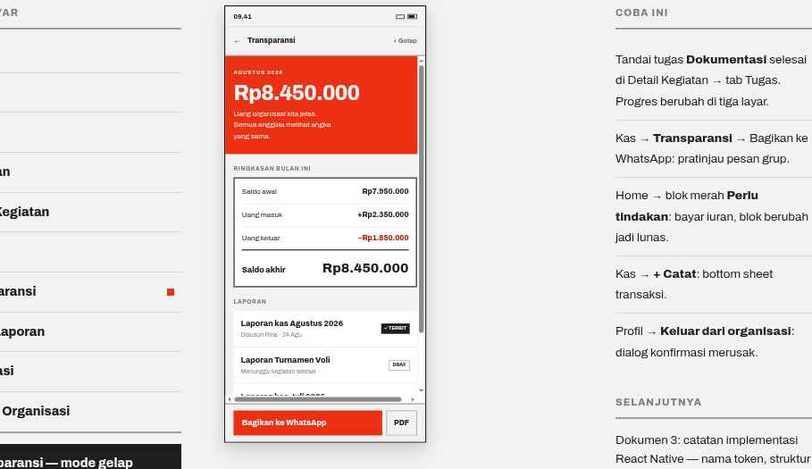

# 07 · Transparansi



**Route** `KasStack/Transparansi`
**Purpose** The signature screen. It must read as "Uang organisasi kita jelas.", not as a ledger.

## Layout
| Order | Block | Spec |
| --- | --- | --- |
| 1 | Header | `←` · `Transparansi` 14/800 · dark-mode toggle `◐ Gelap` 12/800 `color.textMuted` |
| 2 | **Poster block** | full-bleed `color.accent`, padding 24/16. Kicker 10/800 ls 1.4 uppercase at opacity 0.9 `AGUSTUS 2026`; amount 40/800 ls −1.2 tabular; statement 14px max 26ch `Uang organisasi kita jelas. Semua anggota melihat angka yang sama.` |
| 3 | ReportSummary | SectionHeader `RINGKASAN BULAN INI`; 2px `color.text` frame; rows `Saldo awal` / `Uang masuk` / `Uang keluar` at 14px separated by 1px rules, the last closed by a 2px rule; `Saldo akhir` label 15/800 with its value at 26/800 |
| 4 | Laporan list | SectionHeader; ListItems with Tag: solid `✓ TERBIT`, outline `DRAF` |
| 5 | Footnote | 12.5px `color.textMuted`: `Setiap transaksi memiliki bukti dan nama pencatat. Anggota bisa mengajukan pertanyaan lewat tombol di halaman laporan.` |
| 6 | Action bar | primary block `Bagikan ke WhatsApp` plus secondary `PDF` (flex none) |

This poster block is the only full accent field in the flow. Do not add a second one.

## Share behavior
1. `Bagikan ke WhatsApp` opens a BottomSheet titled `Bagikan ke WhatsApp`.
2. The sheet shows the message preview verbatim in a card with a 4px left border, 13.5px / lineHeight 21.6:

```
*Laporan Kas {Bulan} {Tahun}*
{Nama Organisasi} — {Wilayah}

Saldo awal: {saldoAwal}
Uang masuk: +{masuk}
Uang keluar: −{keluar}
*Saldo akhir: {saldoAkhir}*

Rincian lengkap dan bukti:
{tautanLaporan}
```

3. Note under it: `Tautan bisa dibuka siapa saja tanpa memasang aplikasi.`
4. Primary `Kirim ke grup WhatsApp` calls `Linking.openURL('whatsapp://send?text=' + encodeURIComponent(msg))`, falling back to `Share.share()`. Secondary `Salin tautan saja` copies the URL only.
5. On success: Toast `Laporan Agustus dikirim ke grup WhatsApp.` and the report Tag flips to `✓ TERBIT`.

A `DRAF` report shows the band `Belum terbit — belum bisa dibagikan` and its share button is disabled **with that reason as the button label**.
