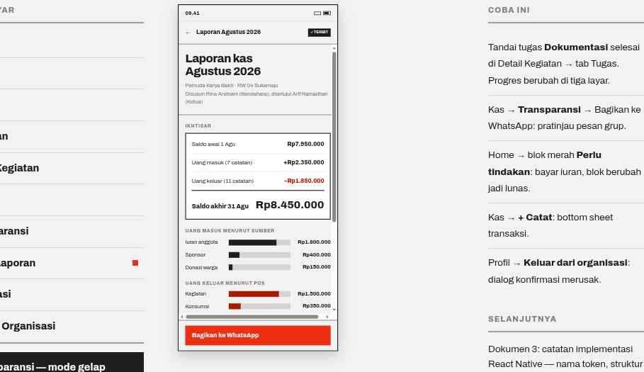

# 08 · Report Detail

**Route** `KasStack/ReportDetail` · also the deep-link target `rukunmuda.id/<org>/<month>`
**Purpose** The full, auditable monthly report.

## Layout
| Order | Block | Spec |
| --- | --- | --- |
| 1 | Header | `←` · `Laporan Agustus 2026` 14/800 · Tag solid `✓ TERBIT` |
| 2 | Title block | 28/800 ls −0.7 across two lines; byline 13px `color.textMuted` carrying the org line and `Disusun Rina Andriani (Bendahara), disetujui Arif Ramadhan (Ketua)` |
| 3 | ReportSummary | SectionHeader `IKHTISAR`; rows name their record counts: `Uang masuk (7 catatan)`, `Uang keluar (11 catatan)`; `Saldo akhir 31 Agu` at 26/800 |
| 4 | Income by source | SectionHeader `UANG MASUK MENURUT SUMBER`; bar rows: label width 96 at 13px, flexible bar height 14 on `color.neutral300` filled `color.text`, value width 88 right-aligned 12.5/800 tabular |
| 5 | Expense by category | identical, bars filled `color.expense` |
| 6 | All records | SectionHeader `SEMUA CATATAN · 18`; TransactionItems whose meta states evidence: `24 Agu · bukti terlampir` |
| 7 | Question | secondary button `Ajukan pertanyaan soal laporan ini` → Toast `Pertanyaan dikirim ke bendahara.` |
| 8 | Action bar | primary block `Bagikan ke WhatsApp` (the same sheet as screen 07) |

## Behavior
- Bar widths are proportional to the largest value in that group, with a 4% minimum so small lines stay visible.
- Every record states whether evidence is attached; one without it reads `tanpa bukti`, never blank.
- The public web version of this screen is what the WhatsApp link opens.
