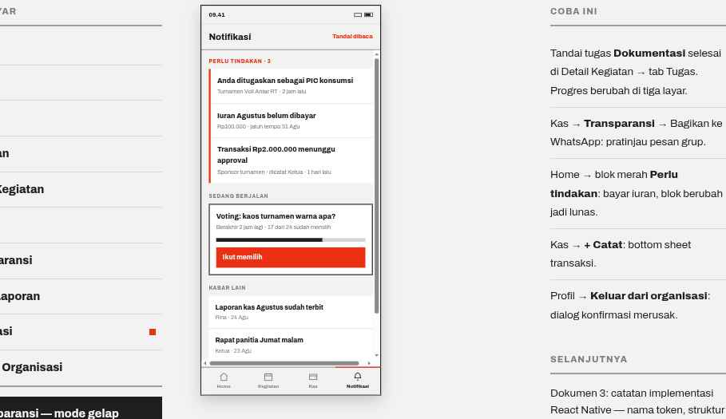

# 09 · Notifikasi

**Route** `App/NotifikasiTab/Notifikasi`
**Purpose** Only what needs the member. Not a feed.

## Layout — exactly three groups, in this order
| Order | Block | Spec |
| --- | --- | --- |
| 1 | Header | title `Notifikasi` 19/800; right action `Tandai dibaca` 12.5/800 `color.accent` |
| 2 | **Perlu tindakan** | SectionHeader in `color.accent` with a count. One Card with a 4px left `color.accent` border; rows carry title 15/800 and meta 12.5px `color.textMuted`. Each row navigates to where the thing gets resolved. |
| 3 | **Sedang berjalan** | SectionHeader; the voting Card sits in a 2px `color.text` frame: title 15/800, meta `Berakhir 2 jam lagi · 17 dari 24 sudah memilih`, bar Progress height 8, primary button height 44 `Ikut memilih` |
| 4 | **Kabar lain** | SectionHeader; ListItems with title 14/800 and meta 12px |

## Copy — the four canonical action items
- `Anda ditugaskan sebagai PIC konsumsi` → EventDetail
- `Iuran Agustus belum dibayar` → IuranSaya
- `Transaksi Rp2.000.000 menunggu approval` → Kas
- `Voting turnamen berakhir 2 jam lagi` → voting

## Behavior
- The tab badge counts group 2 only, and is hidden at zero.
- Never more than three groups. No social-style notifications ("X menyukai...").
- `Tandai dibaca` clears group 4 only; action items stay until they are resolved.
