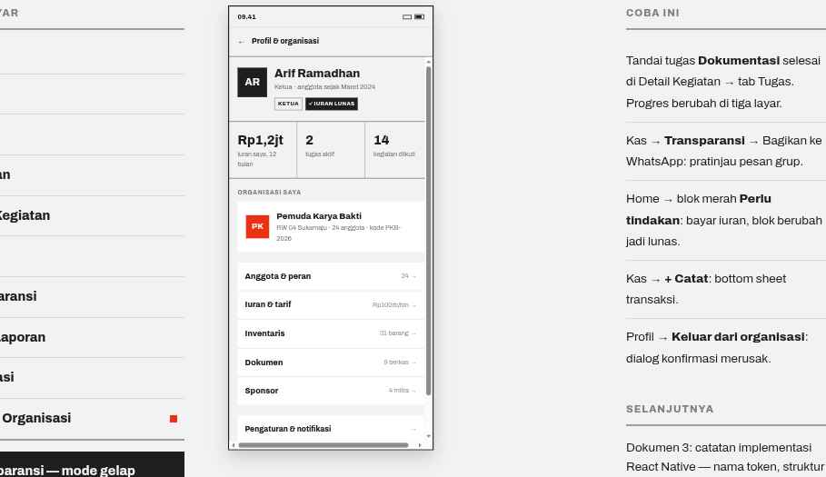

# 10 · Profil & Organisasi

**Route** `RootStack/Profil` with `presentation: 'modal'`, opened from the Home header avatar
**Purpose** Hold everything that is not a daily task, so the tab bar can stay at four.

## Layout
| Order | Block | Spec |
| --- | --- | --- |
| 1 | Header | `←` · `Profil & organisasi` 14/800 |
| 2 | Identity | Avatar 56 · name 22/800 · `Ketua · anggota sejak Maret 2024` 13px `color.textMuted` · Tag row: outline `KETUA`, solid `✓ IURAN LUNAS` |
| 3 | Stats | three equal cells split by 1px `color.divider`, bounded above and below by 2px `color.rule`: `Rp1,2jt` / `2` / `14` at 24/800 with 12px captions `iuran saya, 12 bulan` · `tugas aktif` · `kegiatan diikuti` |
| 4 | Org card | Avatar 44 in `color.accent` · name 16/800 · `RW 04 Sukamaju · 24 anggota · kode PKB-2026` |
| 5 | Org menu | ListItems with trailing counts: `Anggota & peran` 24 · `Iuran & tarif` Rp100rb/bln · `Inventaris` 31 barang · `Dokumen` 9 berkas · `Sponsor` 4 mitra |
| 6 | Account menu | `Pengaturan & notifikasi` → and `Keluar dari organisasi` in `color.accent` |

`Rp1,2jt` is the **only** place abbreviation is allowed. Never on Kas or in a report.

## Behavior
- `Keluar dari organisasi` opens a Dialog: title `Keluar dari organisasi?`, body `Anda tidak lagi melihat kas, kegiatan, dan tugas Pemuda Karya Bakti. Riwayat iuran Anda tetap tersimpan di catatan organisasi.`, buttons `Batal` (secondary) and `Keluar` (primary).
- The five org menu destinations are **not designed yet**. Ask before building them.
