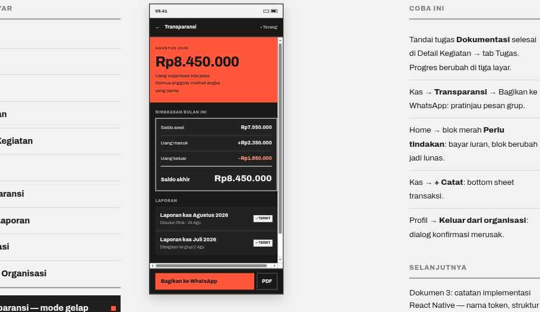

# 11 · Transparansi — dark mode

**Purpose** Prove the token inversion. The layout is identical to screen 07 — only the theme object changes.

## What changes
| Token | Light | Dark |
| --- | --- | --- |
| bg | `#f3f2f2` | `#1a1918` |
| surface | `#ffffff` | `#242221` |
| text | `#201e1d` | `#f3f2f2` |
| divider / rule | `#c9c6c5` / `#8d8988` | `#3d3a39` / `#5c5857` |
| accent | `#ec3013` | `#ff563c` |
| expense | `#ae1800` | `#ff9783` |
| onAccent | `#f3f2f2` | `#1a1918` |

The accent steps up so contrast on the dark ground stays at or above 4.5:1; text on the accent poster block inverts to near-black.

## Behavior
- Follow `useColorScheme()`, with a manual override in Pengaturan.
- No layout, spacing, or type changes of any kind. If a dark screen needs different structure, that is a bug in the light screen.
